# Guide

[TOC]


## Projektet

Projektet består af en web-frontend der taler med en backend.

Backenden består:

- En API gateway (YARP) som er indgangen til backenden.

- To services der indeholder hver sin feature og dennes business logic.

  - Hver service har sin egen SQL database.

  - Der anvendes Entity Framework til at interagere med databasen.

    

## Projekt struktur

Hele løsningen samles i én solution.

**Step 1** Opret en "blank solution" kaldet Forskningensdoegn2025Aspire

**Step 2** Opret en solution folder kaldet Feature

**Step 3** Under Feature folderen. Opret et solution folder kaldet ServiceA

**Step 4** Under Feature folderen. Opret et solution folder kaldet ServiceB

**Step 5** Under Feature folderen. Opret et solution folder kaldet ApiGateway


## Iteration 1

Først vil vi lave en "hello world", hvor vi opretter ServiceA og ServiceB med et hello endpoint, der svare med hhv. "Hello from ServiceA" og "Hello from ServiceB". Herefter opretter vi en YARP ApiGateway foran de to services og ruter alle /ServiceA kald til ServiceA og alle /ServiceB kald til ServiceB. Alle komponenter orkestreres via Aspire. Endelig opretter vi en test, så vi kan tjekke at alt virker. Både ServiceA og ServiceB oprettes som "Minimal API" projekter. Men vi opsætter IKKE Aspire i denne iteration

### ServiceA
Links:

- https://learn.microsoft.com/en-us/aspnet/core/fundamentals/minimal-apis/responses?view=aspnetcore-9.0

  

I solution folderen ServiceA Opret "Empty ASP.NET Core Web API project" kaldet ServiceA
Vælg "Enlist in .NET Aspire orchestration"

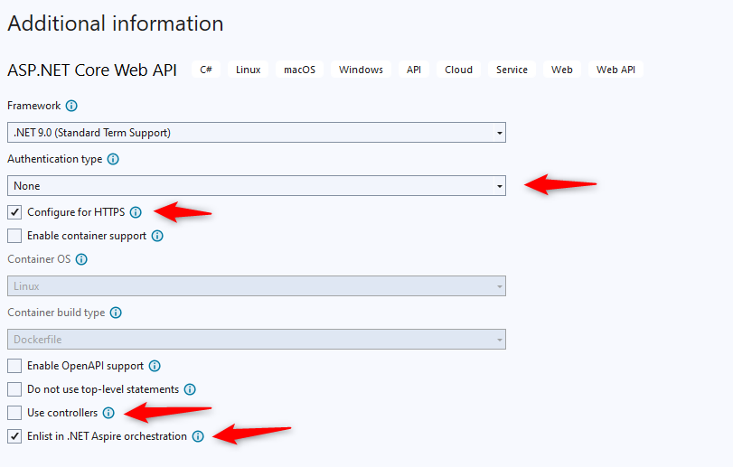

**Tilret Program.cs**

```c#
var builder = WebApplication.CreateBuilder(args);

builder.AddServiceDefaults();

// Add services to the container.

var app = builder.Build();

app.MapDefaultEndpoints();

// Configure the HTTP request pipeline.

app.UseHttpsRedirection();

app.MapGet("/hello", () =>
{
    app.Logger.LogInformation("ServiceA got Hello request");
    var greeting = new HelloResponse("Hello from ServiceA");
    return greeting;
});

app.Run();

internal record HelloResponse(string Greeting)
{
}
```


### ServiceB

I solution folderen ServiceB Opret "Empty ASP.NET Core Web API project" kaldet ServiceB

Vælg "Enlist in .NET Aspire orchestration"

**Tilret Program.cs**

```c#
var builder = WebApplication.CreateBuilder(args);

builder.AddServiceDefaults();

// Add services to the container.

var app = builder.Build();

app.MapDefaultEndpoints();

// Configure the HTTP request pipeline.

app.UseHttpsRedirection();

app.MapGet("/hello", () =>
{
    app.Logger.LogInformation("ServiceB got Hello request");
    var greeting = new HelloResponse("Hello from ServiceB");
    return greeting;
});

app.Run();

internal record HelloResponse(string Greeting)
{
}
```


### ApiGateway

Links:

- https://timdeschryver.dev/blog/integrating-yarp-within-dotnet-aspire
- https://www.milanjovanovic.tech/blog/how-dotnet-aspire-simplifies-service-discovery

I solution folderen ApiGateway Opret "Empty ASP.NET Core Web API project" kaldet Gateway

Vælg "Enlist in .NET Aspire orchestration"

**Nuget pakker:**

Tilføj disse nuget pakker:

- Yarp.ReverseProxy
- Microsoft.Extensions.ServiceDiscovery.Yarp


**Tilret Program.cs**

```c#
var builder = WebApplication.CreateBuilder(args);

builder.AddServiceDefaults();

// Add YARP services
builder.Services.AddReverseProxy()
    .LoadFromConfig(builder.Configuration.GetSection("ReverseProxy"))
    // Configures a destination resolver that can use service discovery
    .AddServiceDiscoveryDestinationResolver();

var app = builder.Build();

// Configure the HTTP request pipeline.
app.MapReverseProxy();

app.Run();
```


**Tilret appsettings.json**

```json
{
  "Logging": {
    "LogLevel": {
      "Default": "Information",
      "Microsoft.AspNetCore": "Warning"
    }
  },
  "AllowedHosts": "*",

  "ReverseProxy": {
    "Routes": {
      "servicea-route": {
        "ClusterId": "servicea-cluster",
        "Match": {
          "Path": "/servicea/{**catch-all}"
        },
        "Transforms": [
          { "PathRemovePrefix": "/servicea" }
        ]
      },
      "serviceb-route": {
        "ClusterId": "serviceb-cluster",
        "Match": {
          "Path": "/serviceb/{**catch-all}"
        },
        "Transforms": [
          { "PathRemovePrefix": "/serviceb" }
        ]
      }
    },
    "Clusters": {
        "servicea-cluster": {
          "Destinations": {
            "destination1": {
              "Address": "http://localhost:[PORT]"
            }
          }
        },
        "serviceb-cluster": {
          "Destinations": {
            "destination1": {
              "Address": "http://localhost:[PORT]"
            }
          }
        }
      }
    }
}
```

OBS: [PORT] skal udskiftes med de konkrete porte - se i hhv. ServiceA og ServiceB filerne "launchSettings.json"

**Tilret Gateway.http**

```
@Gateway_HostAddress = http://localhost:[PORT]

GET {{Gateway_HostAddress}}/ServiceA/Hello
Accept: application/json

###
GET {{Gateway_HostAddress}}/ServiceB/Hello
Accept: application/json
```

OBS [PORT] skal udskiftes med de konkrete porte - se i Gateway filen "launchSettings.json"

### Test

Hvis ikke projektet "Forskningensdoegn2025Aspire.AppHost" står til at være startup projekt, skal du vælge "Forskningensdoegn2025Aspire.AppHost" som startup projekt.

Kør løsningen - følgende skærmbillede bør dukke op (port numre kan være anderledes hos dig)

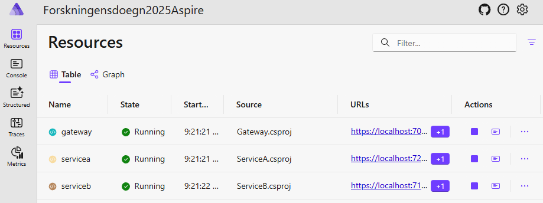

Dette er [.NET Aspire dashboard: Resource details](https://learn.microsoft.com/da-dk/dotnet/aspire/fundamentals/dashboard/explore#resource-details) billedet - det vender vi tilbage til senere.

Åben nu filen Gateway.http (i Visual Studio)

Klik "Send request" og bemærk resultatet:

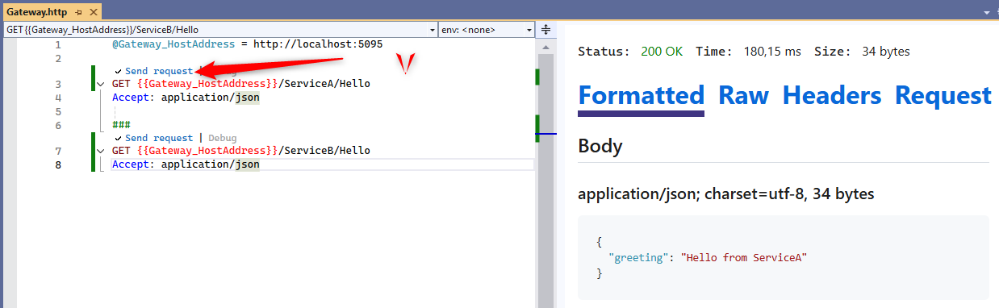


Prøv så den anden Send request og bemærk at greeting ændre sig til "Hello from ServiceB".


### Done

Iteration 1 er afsluttet da vi har en succesfuld test (hvilket var vores DoD kriterie)


## Iteration 2

I denne iteration er der fokus på Aspire orkestrering.

### Forskningensdoegn2025Aspire.AppHost

**Tilret Program.cs**

```c#
var builder = DistributedApplication.CreateBuilder(args);

var serviceA = builder.AddProject<Projects.ServiceA>("servicea");

var serviceB = builder.AddProject<Projects.ServiceB>("serviceb");

var gateway = builder.AddProject<Projects.Gateway>("gateway")
    .WithReference(serviceA)
    .WithReference(serviceB);


builder.Build().Run();
```


### ApiGateway

Den vigtige ændring er her!

Nu udskiftes host og port med orkestrerings info fra Aspire

Links:

- https://www.milanjovanovic.tech/blog/how-dotnet-aspire-simplifies-service-discovery


**Tilret appsettings.json**

```json
{
  "Logging": {
    "LogLevel": {
      "Default": "Information",
      "Microsoft.AspNetCore": "Warning"
    }
  },
  "AllowedHosts": "*",

  "ReverseProxy": {
    "Routes": {
      "servicea-route": {
        "ClusterId": "servicea-cluster",
        "Match": {
          "Path": "/servicea/{**catch-all}"
        },
        "Transforms": [
          { "PathRemovePrefix": "/servicea" }
        ]
      },
      "serviceb-route": {
        "ClusterId": "serviceb-cluster",
        "Match": {
          "Path": "/serviceb/{**catch-all}"
        },
        "Transforms": [
          { "PathRemovePrefix": "/serviceb" }
        ]
      }
    },
    "Clusters": {
        "servicea-cluster": {
          "Destinations": {
            "destination1": {
              "Address": "https+http://servicea"
            }
          }
        },
        "serviceb-cluster": {
          "Destinations": {
            "destination1": {
              "Address": "https+http://serviceb"
            }
          }
        }
      }
    }
}
```


### Test

Testen er den samme som Iteration 1 testen, idet det vi tester er at Aspire "Service Discovery" er sat rigtigt op.

Bemærk at testen er succesfuld

### Done

Iteration 2 er afsluttet da vi har en succesfuld test - vores abstrakte servicenavne i Apigatewayen virker (hvilket var vores DoD kriterie).


## Iteration 3

I denne iteration skal vi have tilkoblet SQL databaser til hhv. ServiceA og ServiceB. Men dette skal ske via Aspire og SQL servere der hostes i Docker.

### Forskningensdoegn2025Aspire.AppHost
Links:
- https://learn.microsoft.com/da-dk/dotnet/aspire/database/sql-server-entity-framework-integration?tabs=dotnet-cli%2Cssms
#### Add SQL Server resource
**Nuget pakker:**

Tilføj disse nuget pakker:  Aspire.Hosting.SqlServer


```c#
var builder = DistributedApplication.CreateBuilder(args);

var sql = builder.AddSqlServer("sql")
    .WithLifetime(ContainerLifetime.Persistent)
    .WithDataVolume(name: "SqlData");

var serviceASqlDb = sql.AddDatabase("serviceADb");
var serviceBSqlDb = sql.AddDatabase("serviceBDb");

var serviceA = builder.AddProject<Projects.ServiceA>("servicea")
    .WithReference(serviceASqlDb)
    .WaitFor(serviceASqlDb);

var serviceB = builder.AddProject<Projects.ServiceB>("serviceb")
    .WithReference(serviceBSqlDb)
    .WaitFor(serviceBSqlDb);

var gateway = builder.AddProject<Projects.Gateway>("gateway")
    .WithExternalHttpEndpoints()
    .WithReference(serviceA)
    .WithReference(serviceB)
    .WaitFor(serviceA)
    .WaitFor(serviceB);


builder.Build().Run();
```

Lidt forklaring:

- WithLifetime(ContainerLifetime.Persistent);
  - [Dokumentation](https://learn.microsoft.com/da-dk/dotnet/aspire/fundamentals/orchestrate-resources?tabs=docker#container-resource-lifetime) : WithLifetime(ContainerLifetime.Persistent)
  - *By default, container resources use the session container lifetime. This means that every time the app host process is started, the container is created and started. When the app host stops, the container is stopped and removed. Container resources can opt-in to a persistent lifetime to avoid unnecessary restarts and use persisted container state.*
- WithDataVolume()
  - [Dokumentation](https://learn.microsoft.com/da-dk/dotnet/aspire/database/sql-server-integration?tabs=dotnet-cli%2Cssms) : WithDataVolume()
  - *The data volume is used to persist the SQL Server data outside the lifecycle of its container. The data volume is mounted at the `/var/opt/mssql` path in the SQL Server container and when a `name` parameter isn't provided, the name is generated at random.*


### ServiceA

Links:

- https://learn.microsoft.com/da-dk/dotnet/aspire/database/sql-server-entity-framework-integration?tabs=dotnet-cli%2Cssms
- https://learn.microsoft.com/en-us/dotnet/aspire/database/sql-server-integrations

**Nuget pakker:**

Tilføj disse nuget pakker:  Aspire.Microsoft.EntityFrameworkCore.SqlServer

**Model**:

Opret en folder kaldet Model

Opret klassen ServiceADbContext med følgende indhold:

```c#
using Microsoft.EntityFrameworkCore;

namespace ServiceA.Model
{
    public class ServiceADbContext(DbContextOptions options) : DbContext(options)
    {
        public DbSet<ServiceAEntity> ServiceAEntites { get; set; }
    }

    public class ServiceAEntity
    {
        public int Id { get; set; }
        public string Name { get; set; }
        public string Description { get; set; }
    }
}
```


**Progam.cs**

```c#
using ServiceA.Model;

var builder = WebApplication.CreateBuilder(args);

builder.AddServiceDefaults();

// Add services to the container.
builder.AddSqlServerDbContext<ServiceADbContext>("serviceADb");

var app = builder.Build();

app.MapDefaultEndpoints();

// Configure the HTTP request pipeline.

app.UseHttpsRedirection();

app.MapGet("/hello", () =>
{
    app.Logger.LogInformation("ServiceA got Hello request");
    var greeting = new HelloResponse("Hello from ServiceA");
    return greeting;
});

// While developing locally, you need to create a database inside the SQL Server container.
using (var scope = app.Services.CreateScope())
{
    var context = scope.ServiceProvider.GetRequiredService<ServiceADbContext>();
    context.Database.EnsureCreated();
    // Check if the database is empty and add a sample entity if it is.
    if (!context.ServiceAEntites.Any())
    {
        context.ServiceAEntites.Add(new ServiceAEntity { Name = "Sample", Description = "Sample description" });
        context.SaveChanges();
    }
}

app.Run();

internal record HelloResponse(string Greeting)
{
}
```

#### Test af Database opsætning for ServiceA

Kør løsningen - følgende skærmbillede bør dukke op (port numre kan være anderledes hos dig)

Første gang du kører løsningen vil der gå nogen tid inden status bliver "Running" - det skyldes at SQL server Docker image skal hentes og at der skal oprettes databaser.

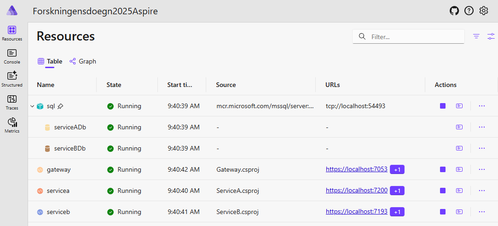


**Docker**

Lad os tjekke hvad der er sket i Docker

Under Containers er der nu startet en SQL server.

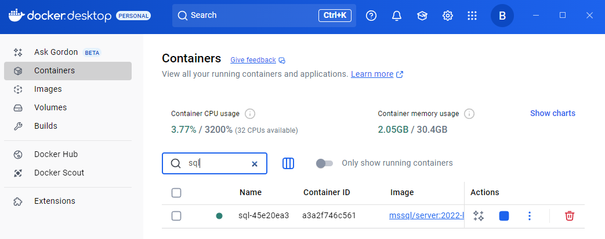

Under Volumes er SqlData oprettet:

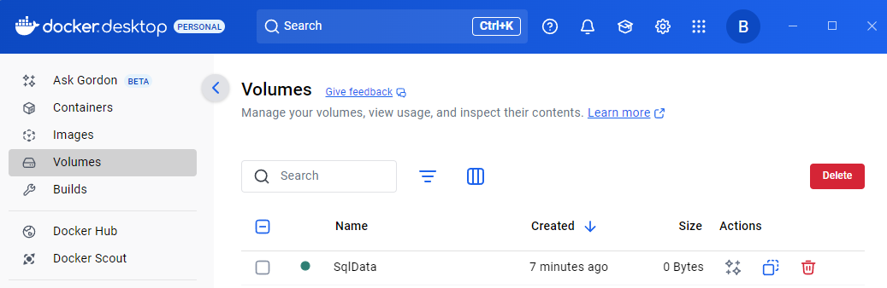

Klik på SqlData - vi kan nu se indholdet. 

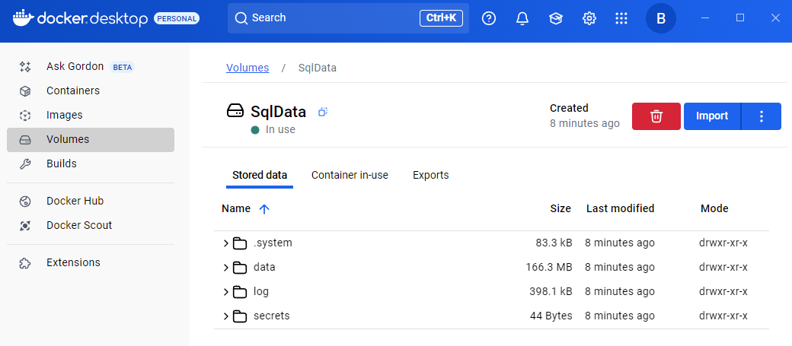

Gå ind i data. Bemærk at de to databaser er oprettet

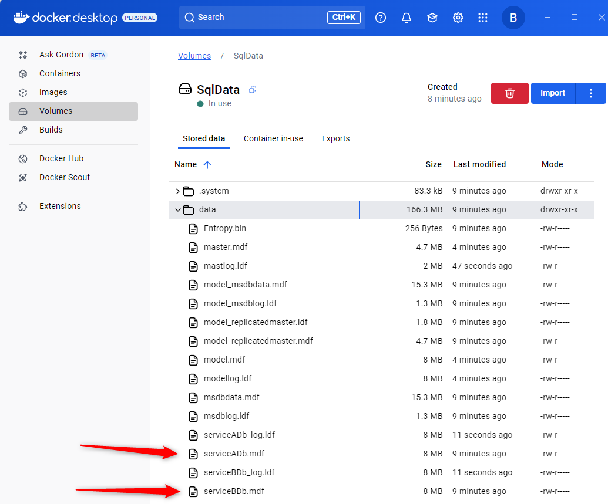


**SQL Server Management Studio**

Fra  ".NET Aspire dashboard: Resource details" billedet skal vi bruge port nummeret - i dette tilfælde 56065 

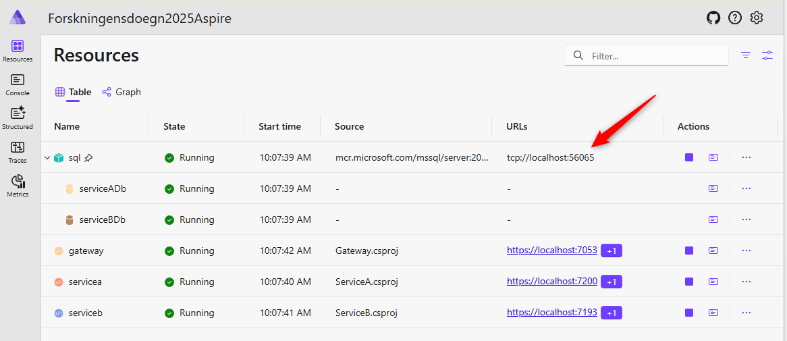

Herudover skal vi bruge Sql serverens password. Klik på "sql". Tryk på "vis" for password og kopier password. I dette tilfælde er password:  bhyUAbGq}e5Pug1b)W!h.s

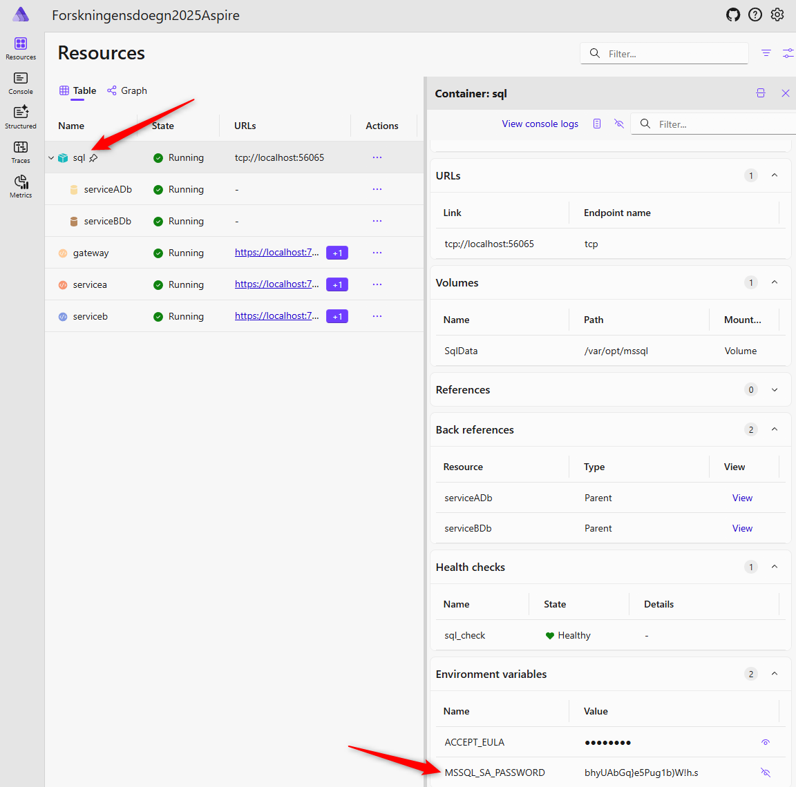

Åben Sql Server Management Studio


Og udfyld 

- servernavn med: 127.0.0.1,56065
  - **OBS bemærk at der er et komma imellem IP og Port** 
  - p.s. Port nummer er hentet fra .NET Aspire dashboard: Resource details
- Login: sa
- Password: bhyUAbGq}e5Pug1b)W!h.s
  - p.s. Password er hentet fra .NET Aspire dashboard: Resource details


Du brude nu se de to databaser

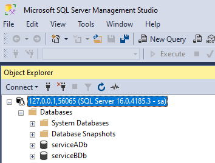


Tjek om der er demo data i serviceADb


Der er data i databasen - det virker :-)


### ServiceB

Links:

- https://learn.microsoft.com/da-dk/dotnet/aspire/database/sql-server-entity-framework-integration?tabs=dotnet-cli%2Cssms
- https://learn.microsoft.com/en-us/dotnet/aspire/database/sql-server-integrations

**Nuget pakker:**

Tilføj disse nuget pakker:  Aspire.Microsoft.EntityFrameworkCore.SqlServer

**Model**:

Opret en folder kaldet Model

Opret klassen ServiceBDbContext med følgende indhold:

```c#
using Microsoft.EntityFrameworkCore;

namespace ServiceB.Model;

public class ServiceBDbContext(DbContextOptions options) : DbContext(options)
{
    public DbSet<ServiceBEntity> ServiceBEntites { get; set; }
}

public class ServiceBEntity
{
    public int Id { get; set; }
    public string Name { get; set; }
    public string Description { get; set; }
}
```


**Progam.cs**

```c#
using ServiceB.Model;

var builder = WebApplication.CreateBuilder(args);

builder.AddServiceDefaults();

// Add services to the container.
builder.AddSqlServerDbContext<ServiceBDbContext>("serviceBDb");

var app = builder.Build();

app.MapDefaultEndpoints();

// Configure the HTTP request pipeline.

app.UseHttpsRedirection();

app.MapGet("/hello", () =>
{
    app.Logger.LogInformation("ServiceB got Hello request");
    var greeting = new HelloResponse("Hello from ServiceB");
    return greeting;
});

// While developing locally, you need to create a database inside the SQL Server container.
using (var scope = app.Services.CreateScope())
{
    var context = scope.ServiceProvider.GetRequiredService<ServiceBDbContext>();
    context.Database.EnsureCreated();
    // Check if the database is empty and add a sample entity if it is.
    if (!context.ServiceBEntites.Any())
    {
        context.ServiceBEntites.Add(new ServiceBEntity { Name = "SampleB", Description = "Sample description B" });
        context.SaveChanges();
    }
}

app.Run();

internal record HelloResponse(string Greeting)
{
}
```


#### Test af Database opsætning for ServiceB

Kør løsningen

Åben Sql Server Management Studio - husk at der måske er et nyt port nummer

Tjek data

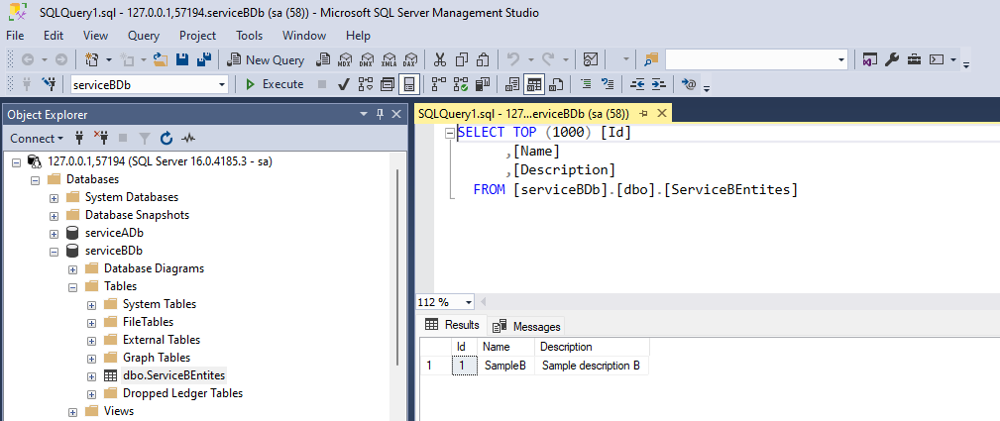

Der er data i databasen - det virker :-)


### Solution overblik

Nedenstående er vis de ændringer der - på fil niveau - er er foretaget i denne iteration

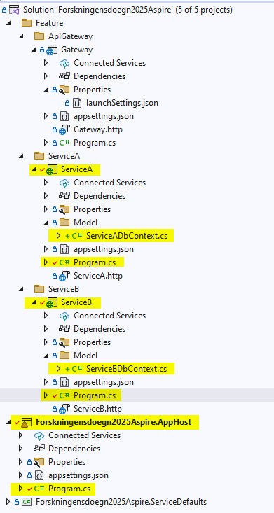

### Done

Iteration 3 er afsluttet da vi har en succesfuld test - Der er data i databasen som er indsat via Entity Framework.

## Iteration 4

I denne iteration skal vi prøve at generer en docker compose fil fra Aspire, idet vi ofte er interesseret i at haven en Docker compose fil.

Links:

- https://learn.microsoft.com/en-us/dotnet/aspire/whats-new/dotnet-aspire-9.2#-deployment-improvements
- https://www.nuget.org/packages/Aspire.Hosting.Docker
- https://devblogs.microsoft.com/dotnet/dotnet-aspire-92-is-now-available-with-new-ways-to-deploy/


###  .NET Aspire CLI

*To build the assets for a publisher, you can use the new experimental .NET Aspire CLI, which is currently available as a global tool. Note that the `--prerelease` switch is required during this experimental period:*

```bash
dotnet tool install -g aspire.cli --prerelease
```


### Forskningensdoegn2025Aspire.AppHost

**Nuget pakker:**

Tilføj disse nuget pakker:  Aspire.Hosting.Docker --version 9.2.0-preview.1.25209.2

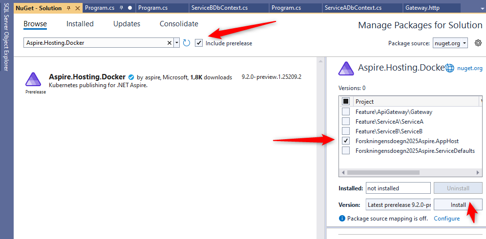


**Program.cs**

```c#
var gateway = builder.AddProject<Projects.Gateway>("gateway")
    .WithExternalHttpEndpoints()
    .WithReference(serviceA)
    .WithReference(serviceB)
    .WaitFor(serviceA)
    .WaitFor(serviceB);

builder.AddDockerComposePublisher();
```


**Dan docker-compose filen**
Åben et terminal vindue ved at højreklikke på "Forskningensdoegn2025Aspire.AppHost" og vælge "Open in Terminal"

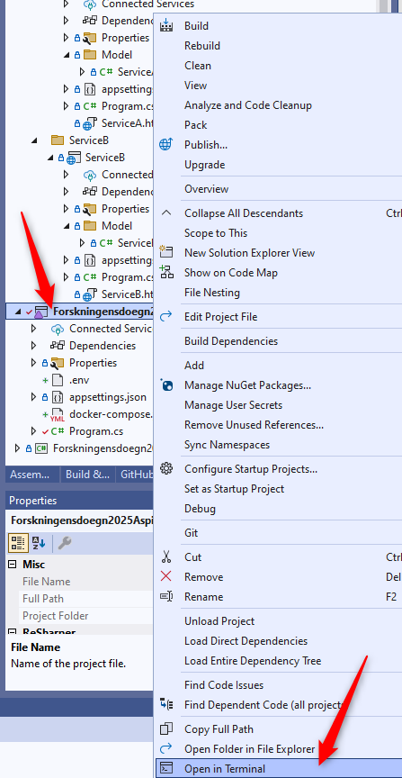


I Terminalen indtastes: ``` aspire publish --publisher docker-compose ```


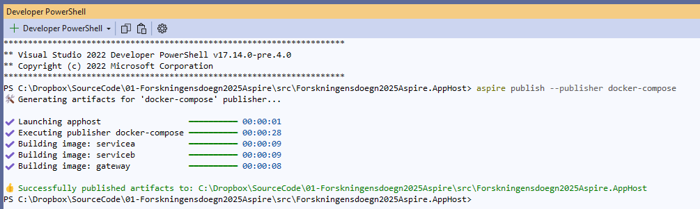

Docker compose filen er nu dannet og indeholder:

**docker-compose.yaml**

```yaml
services:
  sql:
    image: "mcr.microsoft.com/mssql/server:2022-latest"
    environment:
      ACCEPT_EULA: "Y"
      MSSQL_SA_PASSWORD: "${SQL_PASSWORD}"
    ports:
      - "8000:1433"
    volumes:
      - type: "volume"
        target: "/var/opt/mssql"
        source: "SqlData"
        read_only: false
    networks:
      - "aspire"
  servicea:
    image: "${SERVICEA_IMAGE}"
    environment:
      OTEL_DOTNET_EXPERIMENTAL_OTLP_EMIT_EXCEPTION_LOG_ATTRIBUTES: "true"
      OTEL_DOTNET_EXPERIMENTAL_OTLP_EMIT_EVENT_LOG_ATTRIBUTES: "true"
      OTEL_DOTNET_EXPERIMENTAL_OTLP_RETRY: "in_memory"
      ASPNETCORE_FORWARDEDHEADERS_ENABLED: "true"
      HTTP_PORTS: "8001"
      ConnectionStrings__serviceADb: "Server=sql,1433;User ID=sa;Password=${SQL_PASSWORD};TrustServerCertificate=true;Initial Catalog=serviceADb"
    ports:
      - "8002:8001"
      - "8004:8003"
    depends_on:
      sql:
        condition: "service_started"
    networks:
      - "aspire"
  serviceb:
    image: "${SERVICEB_IMAGE}"
    environment:
      OTEL_DOTNET_EXPERIMENTAL_OTLP_EMIT_EXCEPTION_LOG_ATTRIBUTES: "true"
      OTEL_DOTNET_EXPERIMENTAL_OTLP_EMIT_EVENT_LOG_ATTRIBUTES: "true"
      OTEL_DOTNET_EXPERIMENTAL_OTLP_RETRY: "in_memory"
      ASPNETCORE_FORWARDEDHEADERS_ENABLED: "true"
      HTTP_PORTS: "8005"
      ConnectionStrings__serviceBDb: "Server=sql,1433;User ID=sa;Password=${SQL_PASSWORD};TrustServerCertificate=true;Initial Catalog=serviceBDb"
    ports:
      - "8006:8005"
      - "8008:8007"
    depends_on:
      sql:
        condition: "service_started"
    networks:
      - "aspire"
  gateway:
    image: "${GATEWAY_IMAGE}"
    environment:
      OTEL_DOTNET_EXPERIMENTAL_OTLP_EMIT_EXCEPTION_LOG_ATTRIBUTES: "true"
      OTEL_DOTNET_EXPERIMENTAL_OTLP_EMIT_EVENT_LOG_ATTRIBUTES: "true"
      OTEL_DOTNET_EXPERIMENTAL_OTLP_RETRY: "in_memory"
      ASPNETCORE_FORWARDEDHEADERS_ENABLED: "true"
      HTTP_PORTS: "8009"
      services__servicea__http__0: "http://servicea:8001"
      services__serviceb__http__0: "http://serviceb:8005"
    ports:
      - "8010:8009"
      - "8012:8011"
    depends_on:
      servicea:
        condition: "service_started"
      serviceb:
        condition: "service_started"
    networks:
      - "aspire"
networks:
  aspire:
    driver: "bridge"
volumes:
  SqlData:
    driver: "local"

```


## Iteration 5

I denne iteration skal vi have tilkoblet en Web frontend. Vi vælger at lave det som en MVC løsning.

Samtidigt udvidder vi ServiceA og ServiceB således de udstiller et REST endpoint til hhv. ServiceAEntity og ServiceBEntity. 

Web frontenden skal understøtte CRUD operationer for ServiceAEntity og ServiceBEntity.

### Projekt struktur

**Forskningensdoegn2025Aspire**

Tilføj et nyt ASP.NET Core Web App (Model-View-Controller) projekt til Forskningensdoegn2025Aspire solution


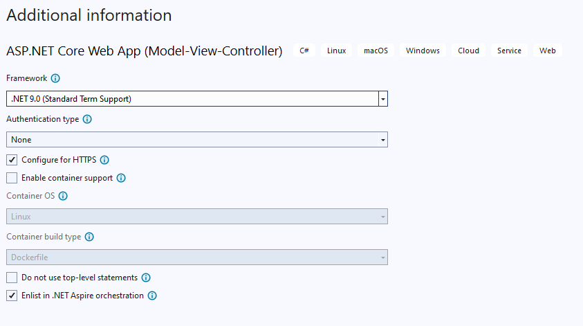

Vælg "Enlist in .NET Aspire orchestration"


### Forskningensdoegn2025Aspire.AppHost

**Tilret Program.cs**

```c#
var builder = DistributedApplication.CreateBuilder(args);

var sql = builder.AddSqlServer("sql")
    .WithLifetime(ContainerLifetime.Persistent)
    .WithDataVolume(name: "SqlData");


var serviceASqlDb = sql.AddDatabase("serviceADb");
var serviceBSqlDb = sql.AddDatabase("serviceBDb");

var serviceA = builder.AddProject<Projects.ServiceA>("servicea")
    .WithReference(serviceASqlDb)
    .WaitFor(serviceASqlDb);

var serviceB = builder.AddProject<Projects.ServiceB>("serviceb")
    .WithReference(serviceBSqlDb)
    .WaitFor(serviceBSqlDb);

var gateway = builder.AddProject<Projects.Gateway>("gateway")
    .WithExternalHttpEndpoints()
    .WithReference(serviceA)
    .WithReference(serviceB)
    .WaitFor(serviceA)
    .WaitFor(serviceB);

builder.AddDockerComposePublisher();

builder.AddProject<Projects.MvcFrontend>("mvcfrontend")
    .WithReference(gateway)
    .WaitFor(gateway);

builder.Build().Run();
```


### ServiceA


**Program.cs**

```c#
using ServiceA.Model;

var builder = WebApplication.CreateBuilder(args);

builder.AddServiceDefaults();
builder.Services.AddControllers();

// Add services to the container.
builder.AddSqlServerDbContext<ServiceADbContext>("serviceADb");

var app = builder.Build();

app.MapDefaultEndpoints();

// Configure the HTTP request pipeline.

app.UseHttpsRedirection();

app.MapGet("/hello", () =>
{
    app.Logger.LogInformation("ServiceA got Hello request");
    var greeting = new HelloResponse("Hello from ServiceA");
    return greeting;
});

app.MapControllers();

// While developing locally, you need to create a database inside the SQL Server container.
using (var scope = app.Services.CreateScope())
{
    var context = scope.ServiceProvider.GetRequiredService<ServiceADbContext>();
    context.Database.EnsureCreated();
    // Check if the database is empty and add a sample entity if it is.
    if (!context.ServiceAEntites.Any())
    {
        context.ServiceAEntites.Add(new ServiceAEntity { Name = "Sample", Description = "Sample description" });
        context.SaveChanges();
    }
}

app.Run();

internal record HelloResponse(string Greeting)
{
}
```

#### API Controllers

Opret folderen Controllers
Opret ServiceAEntityController - Højreklik på Controllers mappen -> Add -> Controller


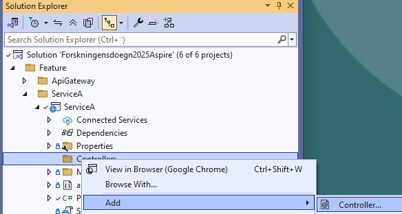


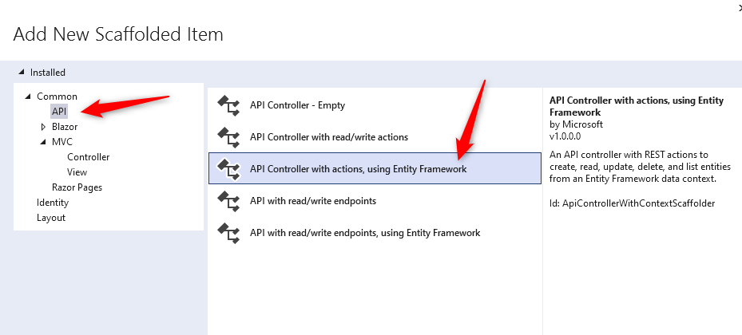


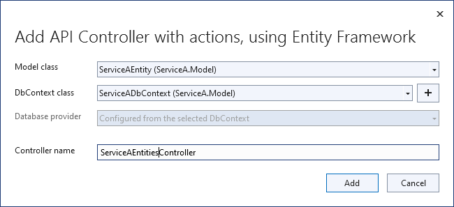


Herefter autogenereres en controller.

Denne tilpasses ifht. URL. Og envidere anvendes en DTO i stedet for entity objekter ind og ud af controlleren.

Den færdige controller ser således ud

**ServiceAEntitiesController.cs**

```c#
using Microsoft.AspNetCore.Mvc;
using Microsoft.EntityFrameworkCore;
using ServiceA.Model;

namespace ServiceA.Controllers;

[Route("[controller]")] //Tilrettet
[ApiController]
public class ServiceAEntitiesController : ControllerBase
{
    private readonly ServiceADbContext _context;

    public ServiceAEntitiesController(ServiceADbContext context)
    {
        _context = context;
    }

    // GET: ServiceAEntities
    [HttpGet]
    public async Task<ActionResult<IEnumerable<ServiceAEntityDto>>> GetServiceAEntites()
    {
        return await _context.ServiceAEntites
            .Select(a => new ServiceAEntityDto(a.Id, a.Name, a.Description))
            .ToListAsync();
    }

    // GET: ServiceAEntities/5
    [HttpGet("{id}")]
    public async Task<ActionResult<ServiceAEntityDto>> GetServiceAEntity(int id)
    {
        var serviceAEntity = await _context.ServiceAEntites.FindAsync(id);

        if (serviceAEntity == null) return NotFound();

        return new ServiceAEntityDto(serviceAEntity.Id, serviceAEntity.Name, serviceAEntity.Description);
    }

    // PUT: ServiceAEntities/5
    // To protect from overposting attacks, see https://go.microsoft.com/fwlink/?linkid=2123754
    [HttpPut("{id}")]
    public async Task<IActionResult> PutServiceAEntity(int id, ServiceAEntityDto dto)
    {
        if (id != dto.Id) return BadRequest();
        var serviceAEntity = ConvertFromDto(dto);
        _context.Entry(serviceAEntity).State = EntityState.Modified;

        try
        {
            await _context.SaveChangesAsync();
        }
        catch (DbUpdateConcurrencyException)
        {
            if (!ServiceAEntityExists(id)) return NotFound();

            throw;
        }

        return NoContent();
    }

    // POST: ServiceAEntities
    // To protect from overposting attacks, see https://go.microsoft.com/fwlink/?linkid=2123754
    [HttpPost]
    public async Task<ActionResult<ServiceAEntityDto>> PostServiceAEntity(ServiceAEntityDto dto)
    {
        var serviceAEntity = ConvertFromDto(dto);
        _context.ServiceAEntites.Add(serviceAEntity);
        await _context.SaveChangesAsync();

        return CreatedAtAction("GetServiceAEntity", new { id = serviceAEntity.Id },
            new ServiceAEntityDto(serviceAEntity.Id, serviceAEntity.Name, serviceAEntity.Description));
    }

    // DELETE: ServiceAEntities/5
    [HttpDelete("{id}")]
    public async Task<IActionResult> DeleteServiceAEntity(int id)
    {
        var serviceAEntity = await _context.ServiceAEntites.FindAsync(id);
        if (serviceAEntity == null) return NotFound();

        _context.ServiceAEntites.Remove(serviceAEntity);
        await _context.SaveChangesAsync();

        return NoContent();
    }

    private bool ServiceAEntityExists(int id)
    {
        return _context.ServiceAEntites.Any(e => e.Id == id);
    }

    private ServiceAEntity ConvertFromDto(ServiceAEntityDto entity)
    {
        return new ServiceAEntity
        {
            Id = entity.Id,
            Name = entity.Name,
            Description = entity.Description
        };
    }
}

// DTO for ServiceAEntity
public record ServiceAEntityDto(int Id, string Name, string Description);
```


#### ServiceB

Lav det tilsvarende arbejde for ServiceB


### MvcFrontend

#### Typed http client

Efter min mening er Typed Client den bedste måde at lave en api proxy klasse. Den læner sig op ad "remote proxy" design mønstret. Det er vigtigt at anvende "AddHttpClient" idet man herved bruger HttpClientFactory, som sikre mod socket exhaustion

Links:

- https://learn.microsoft.com/en-us/aspnet/core/fundamentals/http-requests?view=aspnetcore-9.0#typed-clients
- https://learn.microsoft.com/en-us/dotnet/fundamentals/networking/http/httpclient-guidelines

**Service proxy klasser**

Opret folderen ApiService

Opret klasserne ServiceA og ServiceB

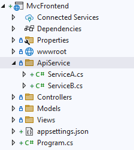

I begge klasser oprettes en constructor der tager argumentet: HttpClient httpClient

**ServiceA**

```c#
namespace MvcFrontend.ApiService;

public class ServiceA
{
    private readonly HttpClient _api;

    public ServiceA(HttpClient httpClient)
    {
        _api = httpClient;
    }

    public async Task<IEnumerable<ServiceAEntityDto>> GetServiceAEntities()
    {
        var response = await _api.GetAsync("ServiceAEntities");
        response.EnsureSuccessStatusCode();
        var result = await response.Content.ReadFromJsonAsync<IEnumerable<ServiceAEntityDto>>();
        return result ?? [];
    }

    public async Task<ServiceAEntityDto> GetServiceAEntity(int id)
    {
        var response = await _api.GetAsync($"ServiceAEntities/{id}");
        response.EnsureSuccessStatusCode();
        var result = await response.Content.ReadFromJsonAsync<ServiceAEntityDto>();
        return result ?? throw new Exception("Entity not found");
    }

    public async Task<ServiceAEntityDto> CreateServiceAEntity(ServiceAEntityDto dto)
    {
        var response = await _api.PostAsJsonAsync("ServiceAEntities", dto);
        response.EnsureSuccessStatusCode();
        var result = await response.Content.ReadFromJsonAsync<ServiceAEntityDto>();
        return result ?? throw new Exception("Failed to create entity");
    }

    public async Task UpdateServiceAEntity(int id, ServiceAEntityDto dto)
    {
        var response = await _api.PutAsJsonAsync($"ServiceAEntities/{id}", dto);
        response.EnsureSuccessStatusCode();
    }

    public async Task DeleteServiceAEntity(int id)
    {
        var response = await _api.DeleteAsync($"ServiceAEntities/{id}");
        response.EnsureSuccessStatusCode();
    }
}

// DTO for ServiceAEntity
public record ServiceAEntityDto(int Id, string Name, string Description);
```


**ServiceB**

På tilsvarende vis oprettes ServiceB


**Program.cs**

Opret service proxy'erne i IoC ved brug af HttpClientFactory

```c#
using MvcFrontend.ApiService;

var builder = WebApplication.CreateBuilder(args);

builder.AddServiceDefaults();

// Add services to the container.
builder.Services.AddControllersWithViews();

builder.Services.AddHttpClient<ServiceA>
(httpClient => httpClient.BaseAddress = new Uri("https+http://gateway/servicea/"));

builder.Services.AddHttpClient<ServiceB>
(httpClient => httpClient.BaseAddress = new Uri("https+http://gateway/serviceb/"));
```


Bemærk base adreserne - de kobler til Aspire, hvor "gateway" er defineret.


#### MVC Controllers

"Bunden" er nu klar, og vi kan lave UI delen. Her snyder vi lidt og bruger DTO klasserne som ViewModels. Der er dårlig praksis! men vi gør det for at spare lidt tid.

Og... vi vælger at "snyde" for at få autogenereret vores Views.

**Inden vi fortsætter er det en rigtig god ide at lave et git commit !!!**


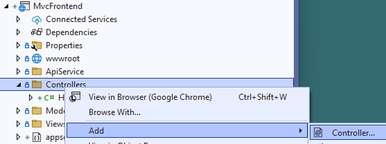


For at få autogenereret Views "snyder" vi ved at bruge Entityframework.

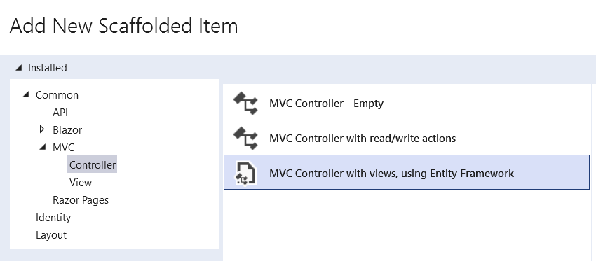

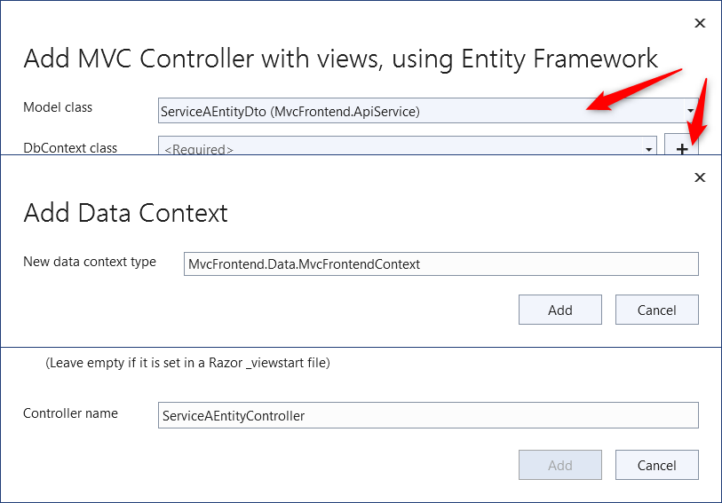

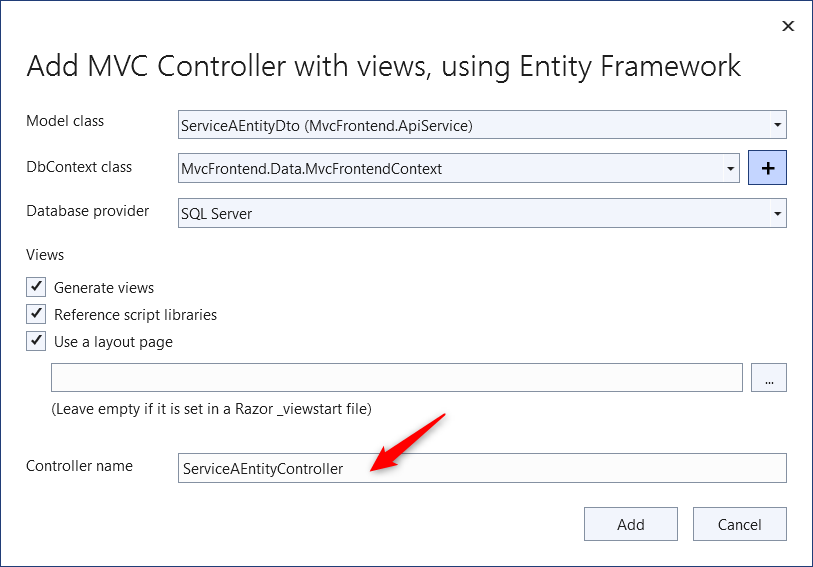


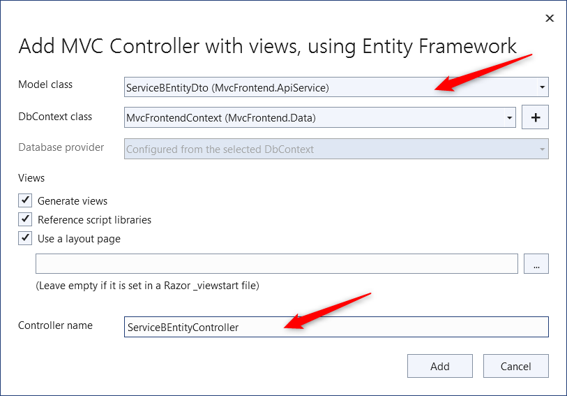

**Snyd koster - der skal ryddes op**

Vi bruger git til at rydde op ved at slette de ting der er oprettet pga. at vi snød ved at anvende entityframework.


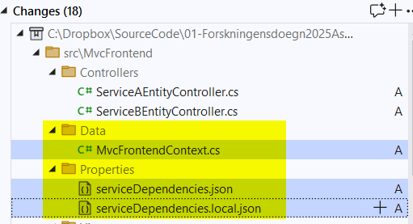

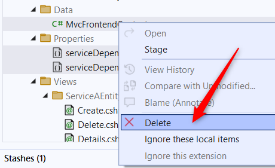

Dernæst skal vi have rullet de ændringer tilbage der er sket i eksisterende filer.


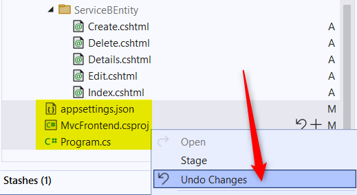

Og endeligt skal den autogenererede controller kode ændres således at Api proxy klassserne anvendes i stedet for entityframework.

**ServiceAEntityController.cs**

```c#
using Microsoft.AspNetCore.Mvc;
using MvcFrontend.ApiService;

namespace MvcFrontend.Controllers;

public class ServiceAEntityController : Controller
{
    private readonly ServiceA _api;

    public ServiceAEntityController(ServiceA api)
    {
        _api = api;
    }

    // GET: ServiceAEntity
    public async Task<IActionResult> Index()
    {
        return View(await _api.GetServiceAEntities());
    }

    // GET: ServiceAEntity/Details/5
    public async Task<IActionResult> Details(int id)
    {
        var serviceAEntityDto = await _api.GetServiceAEntity(id);

        return View(serviceAEntityDto);
    }

    // GET: ServiceAEntity/Create
    public IActionResult Create()
    {
        return View();
    }

    // POST: ServiceAEntity/Create
    // To protect from overposting attacks, enable the specific properties you want to bind to.
    // For more details, see http://go.microsoft.com/fwlink/?LinkId=317598.
    [HttpPost]
    [ValidateAntiForgeryToken]
    public async Task<IActionResult> Create([Bind("Id,Name,Description")] ServiceAEntityDto serviceAEntityDto)
    {
        if (ModelState.IsValid)
        {
            await _api.CreateServiceAEntity(serviceAEntityDto);
            return RedirectToAction(nameof(Index));
        }

        return View(serviceAEntityDto);
    }

    // GET: ServiceAEntity/Edit/5
    public async Task<IActionResult> Edit(int id)
    {
        var serviceAEntityDto = await _api.GetServiceAEntity(id);

        return View(serviceAEntityDto);
    }

    // POST: ServiceAEntity/Edit/5
    // To protect from overposting attacks, enable the specific properties you want to bind to.
    // For more details, see http://go.microsoft.com/fwlink/?LinkId=317598.
    [HttpPost]
    [ValidateAntiForgeryToken]
    public async Task<IActionResult> Edit(int id, [Bind("Id,Name,Description")] ServiceAEntityDto serviceAEntityDto)
    {
        if (id != serviceAEntityDto.Id) return NotFound();

        if (ModelState.IsValid)
        {
            await _api.UpdateServiceAEntity(id, serviceAEntityDto);

            return RedirectToAction(nameof(Index));
        }

        return View(serviceAEntityDto);
    }

    // GET: ServiceAEntity/Delete/5
    public async Task<IActionResult> Delete(int id)
    {
        var serviceAEntityDto = await _api.GetServiceAEntity(id);

        return View(serviceAEntityDto);
    }

    // POST: ServiceAEntity/Delete/5
    [HttpPost]
    [ActionName("Delete")]
    [ValidateAntiForgeryToken]
    public async Task<IActionResult> DeleteConfirmed(int id)
    {
        await _api.DeleteServiceAEntity(id);

        return RedirectToAction(nameof(Index));
    }
}
```

**ServiceBEntityController.cs**

```c#
using Microsoft.AspNetCore.Mvc;
using Microsoft.EntityFrameworkCore;
using ServiceB.Model;

namespace ServiceB.Controllers;

[Route("[controller]")]
[ApiController]
public class ServiceBEntitiesController : ControllerBase
{
    private readonly ServiceBDbContext _context;

    public ServiceBEntitiesController(ServiceBDbContext context)
    {
        _context = context;
    }

    // GET: ServiceBEntities
    [HttpGet]
    public async Task<ActionResult<IEnumerable<ServiceBEntityDto>>> GetServiceBEntites()
    {
        return await _context.ServiceBEntites
            .Select(a => new ServiceBEntityDto(a.Id, a.Name, a.Description))
            .ToListAsync();
    }

    // GET: ServiceBEntities/5
    [HttpGet("{id}")]
    public async Task<ActionResult<ServiceBEntityDto>> GetServiceBEntity(int id)
    {
        var serviceAEntity = await _context.ServiceBEntites.FindAsync(id);

        if (serviceAEntity == null) return NotFound();

        return new ServiceBEntityDto(serviceAEntity.Id, serviceAEntity.Name, serviceAEntity.Description);
    }

    // PUT: ServiceBEntities/5
    // To protect from overposting attacks, see https://go.microsoft.com/fwlink/?linkid=2123754
    [HttpPut("{id}")]
    public async Task<IActionResult> PutServiceBEntity(int id, ServiceBEntityDto dto)
    {
        if (id != dto.Id) return BadRequest();
        var serviceAEntity = ConvertFromDto(dto);
        _context.Entry(serviceAEntity).State = EntityState.Modified;
        _context.Entry(serviceAEntity).State = EntityState.Modified;

        try
        {
            await _context.SaveChangesAsync();
        }
        catch (DbUpdateConcurrencyException)
        {
            if (!ServiceAEntityExists(id)) return NotFound();

            throw;
        }

        return NoContent();
    }

    // POST: ServiceBEntities
    // To protect from overposting attacks, see https://go.microsoft.com/fwlink/?linkid=2123754
    [HttpPost]
    public async Task<ActionResult<ServiceBEntityDto>> PostServiceBEntity(ServiceBEntityDto dto)
    {
        var serviceAEntity = ConvertFromDto(dto);
        _context.ServiceBEntites.Add(serviceAEntity);
        await _context.SaveChangesAsync();

        return CreatedAtAction("GetServiceBEntity", new { id = serviceAEntity.Id },
            new ServiceBEntityDto(serviceAEntity.Id, serviceAEntity.Name, serviceAEntity.Description));
    }

    // DELETE: ServiceBEntities/5
    [HttpDelete("{id}")]
    public async Task<IActionResult> DeleteServiceBEntity(int id)
    {
        var serviceAEntity = await _context.ServiceBEntites.FindAsync(id);
        if (serviceAEntity == null) return NotFound();

        _context.ServiceBEntites.Remove(serviceAEntity);
        await _context.SaveChangesAsync();

        return NoContent();
    }

    private bool ServiceAEntityExists(int id)
    {
        return _context.ServiceBEntites.Any(e => e.Id == id);
    }

    private ServiceBEntity ConvertFromDto(ServiceBEntityDto entity)
    {
        return new ServiceBEntity
        {
            Id = entity.Id,
            Name = entity.Name,
            Description = entity.Description
        };
    }
}

// DTO for ServiceBEntity
public record ServiceBEntityDto(int Id, string Name, string Description);
```


Nu mangler vi bare at få de nye features med i menuen

**_Layout.cshtml**

```html
<!DOCTYPE html>
<html lang="en">
<head>
    <meta charset="utf-8" />
    <meta name="viewport" content="width=device-width, initial-scale=1.0" />
    <title>@ViewData["Title"] - MvcFrontend</title>
    <script type="importmap"></script>
    <link rel="stylesheet" href="~/lib/bootstrap/dist/css/bootstrap.min.css" />
    <link rel="stylesheet" href="~/css/site.css" asp-append-version="true" />
    <link rel="stylesheet" href="~/MvcFrontend.styles.css" asp-append-version="true" />
</head>
<body>
    <header>
        <nav class="navbar navbar-expand-sm navbar-toggleable-sm navbar-light bg-white border-bottom box-shadow mb-3">
            <div class="container-fluid">
                <a class="navbar-brand" asp-area="" asp-controller="Home" asp-action="Index">MvcFrontend</a>
                <button class="navbar-toggler" type="button" data-bs-toggle="collapse" data-bs-target=".navbar-collapse" aria-controls="navbarSupportedContent"
                        aria-expanded="false" aria-label="Toggle navigation">
                    <span class="navbar-toggler-icon"></span>
                </button>
                <div class="navbar-collapse collapse d-sm-inline-flex justify-content-between">
                    <ul class="navbar-nav flex-grow-1">
                        <li class="nav-item">
                            <a class="nav-link text-dark" asp-area="" asp-controller="Home" asp-action="Index">Home</a>
                        </li>
                        <li class="nav-item">
                            <a class="nav-link text-dark" asp-area="" asp-controller="ServiceAEntity" asp-action="Index">ServiceAEntity</a>
                        </li>
                        <li class="nav-item">
                            <a class="nav-link text-dark" asp-area="" asp-controller="ServiceBEntity" asp-action="Index">ServiceBEntity</a>
                        </li>
                        <li class="nav-item">
                            <a class="nav-link text-dark" asp-area="" asp-controller="Home" asp-action="Privacy">Privacy</a>
                        </li>
                    </ul>
                </div>
            </div>
        </nav>
    </header>
    <div class="container">
        <main role="main" class="pb-3">
            @RenderBody()
        </main>
    </div>

    <footer class="border-top footer text-muted">
        <div class="container">
            &copy; 2025 - MvcFrontend - <a asp-area="" asp-controller="Home" asp-action="Privacy">Privacy</a>
        </div>
    </footer>
    <script src="~/lib/jquery/dist/jquery.min.js"></script>
    <script src="~/lib/bootstrap/dist/js/bootstrap.bundle.min.js"></script>
    <script src="~/js/site.js" asp-append-version="true"></script>
    @await RenderSectionAsync("Scripts", required: false)
</body>
</html>

```


### Test

Hvis ikke projektet "Forskningensdoegn2025Aspire.AppHost" står til at være startup projekt, skal du vælge "Forskningensdoegn2025Aspire.AppHost" som startup projekt.

Kør løsningen - følgende skærmbillede bør dukke op (port numre kan være anderledes hos dig)

Klik på "mvcfrontend"

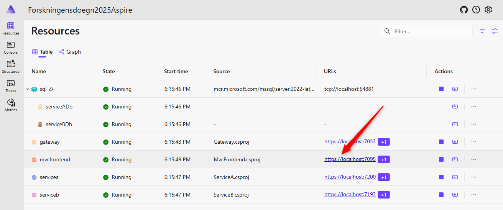

Klik på ServiceAEntity

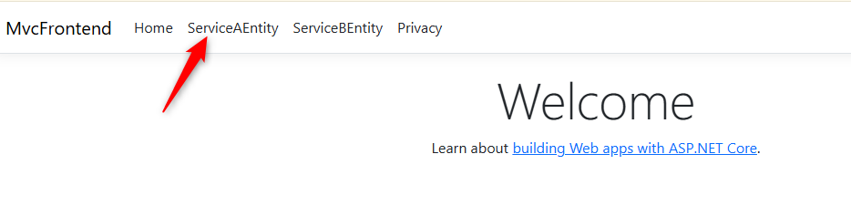


Bemærk at der kommer data :-)

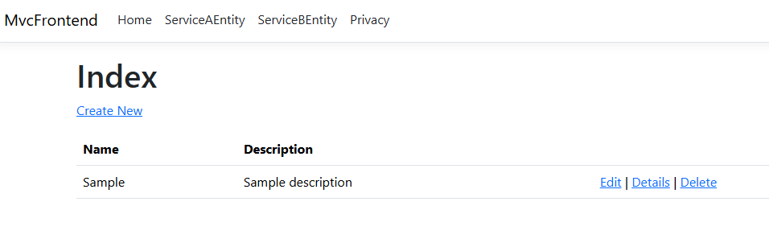

Prøv at klikke på Traces

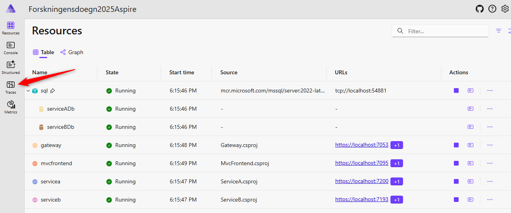

Zoom ind

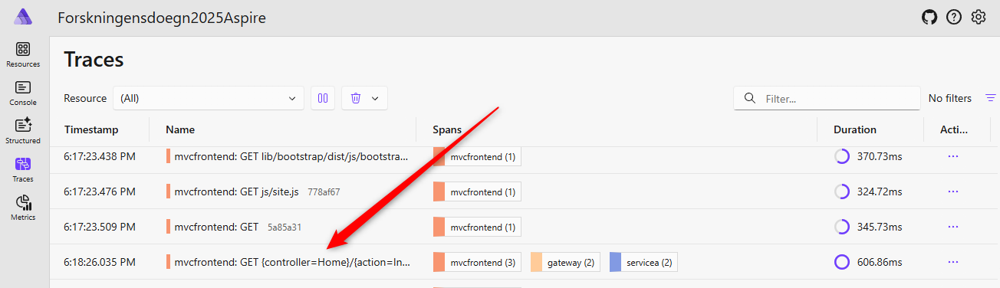

Og... Her har du et overblik over hvilke dele af løsningen der er "langsom".

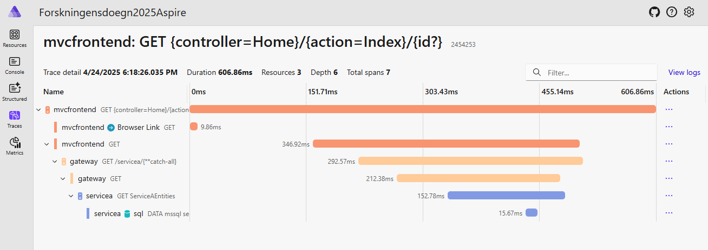

Prøv nu at klikke på Graph

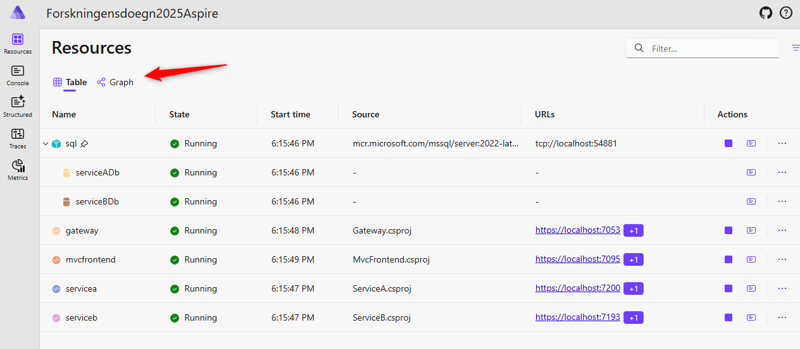

Og... Her ser du komponenterne i løsningen og hvorledes de "hænger sammen"

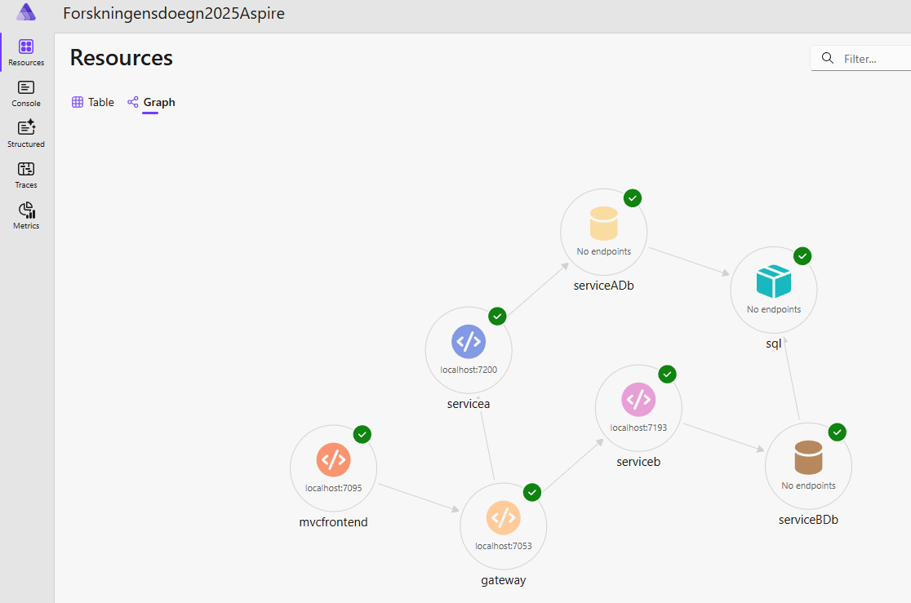
