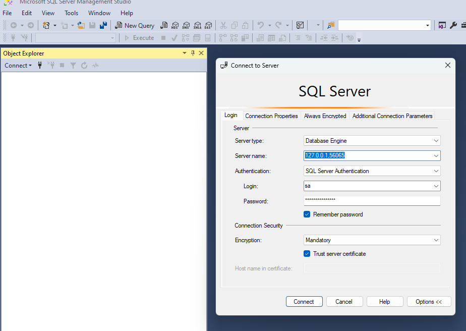
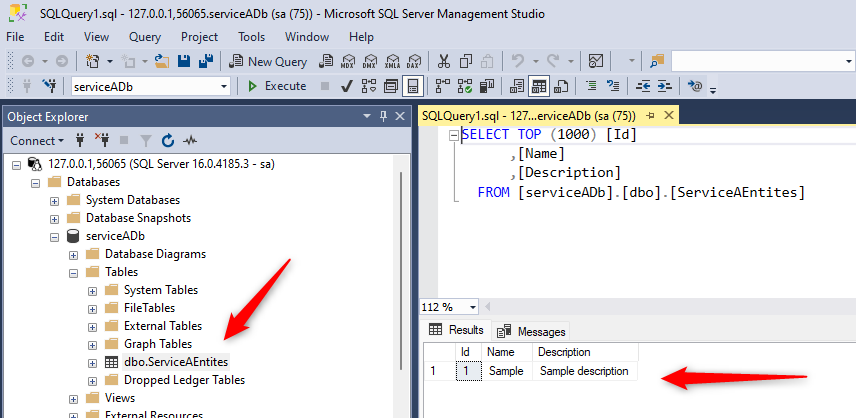

# Guide

## Projektet

Projektet består af en web-frontend der taler med en backend.

Backenden består:

- En API gateway (YARP) som er indgangen til backenden.

- To services der indeholder hver sin feature og dennes business logic.

  - Hver service har sin egen SQL database.

  - Der anvendes Entity Framework til at interagere med databasen.

    

## Projekt struktur

Hele løsningen samles i én solution.

**Step 1** Opret en "blank solution" kaldet Forskningensdoegn2025Aspire

**Step 2** Opret en solution folder kaldet Feature

**Step 3** Under Feature folderen. Opret et solution folder kaldet ServiceA

**Step 4** Under Feature folderen. Opret et solution folder kaldet ServiceB

**Step 5** Under Feature folderen. Opret et solution folder kaldet ApiGateway


## Iteration 1

Først vil vi lave en "hello world", hvor vi opretter ServiceA og ServiceB med et hello endpoint, der svare med hhv. "Hello from ServiceA" og "Hello from ServiceB". Herefter opretter vi en YARP ApiGateway foran de to services og ruter alle /ServiceA kald til ServiceA og alle /ServiceB kald til ServiceB. Alle komponenter orkestreres via Aspire. Endelig opretter vi en test, så vi kan tjekke at alt virker. Både ServiceA og ServiceB oprettes som "Minimal API" projekter. Men vi opsætter IKKE Aspire i denne iteration

### ServiceA
Links:

- https://learn.microsoft.com/en-us/aspnet/core/fundamentals/minimal-apis/responses?view=aspnetcore-9.0

  

I solution folderen ServiceA Opret "Empty ASP.NET Core Web API project" kaldet ServiceA
Vælg "Enlist in .NET Aspire orchestration"


**Tilret Program.cs**

```c#
var builder = WebApplication.CreateBuilder(args);

builder.AddServiceDefaults();

// Add services to the container.

var app = builder.Build();

app.MapDefaultEndpoints();

// Configure the HTTP request pipeline.

app.UseHttpsRedirection();

app.MapGet("/hello", () =>
{
    app.Logger.LogInformation("ServiceA got Hello request");
    var greeting = new HelloResponse("Hello from ServiceA");
    return greeting;
});

app.Run();

internal record HelloResponse(string Greeting)
{
}
```


### ServiceB

I solution folderen ServiceB Opret "Empty ASP.NET Core Web API project" kaldet ServiceB

Vælg "Enlist in .NET Aspire orchestration"

**Tilret Program.cs**

```c#
var builder = WebApplication.CreateBuilder(args);

builder.AddServiceDefaults();

// Add services to the container.

var app = builder.Build();

app.MapDefaultEndpoints();

// Configure the HTTP request pipeline.

app.UseHttpsRedirection();

app.MapGet("/hello", () =>
{
    app.Logger.LogInformation("ServiceB got Hello request");
    var greeting = new HelloResponse("Hello from ServiceB");
    return greeting;
});

app.Run();

internal record HelloResponse(string Greeting)
{
}
```


### ApiGateway

Links:

- https://timdeschryver.dev/blog/integrating-yarp-within-dotnet-aspire
- https://www.milanjovanovic.tech/blog/how-dotnet-aspire-simplifies-service-discovery

I solution folderen ApiGateway Opret "Empty ASP.NET Core Web API project" kaldet Gateway

Vælg "Enlist in .NET Aspire orchestration"

**Nuget pakker:**

Tilføj disse nuget pakker:

- Yarp.ReverseProxy
- Microsoft.Extensions.ServiceDiscovery.Yarp


**Tilret Program.cs**

```c#
var builder = WebApplication.CreateBuilder(args);

builder.AddServiceDefaults();

// Add YARP services
builder.Services.AddReverseProxy()
    .LoadFromConfig(builder.Configuration.GetSection("ReverseProxy"))
    // Configures a destination resolver that can use service discovery
    .AddServiceDiscoveryDestinationResolver();

var app = builder.Build();

// Configure the HTTP request pipeline.
app.MapReverseProxy();

app.Run();
```


**Tilret appsettings.json**

```json
{
  "Logging": {
    "LogLevel": {
      "Default": "Information",
      "Microsoft.AspNetCore": "Warning"
    }
  },
  "AllowedHosts": "*",

  "ReverseProxy": {
    "Routes": {
      "servicea-route": {
        "ClusterId": "servicea-cluster",
        "Match": {
          "Path": "/servicea/{**catch-all}"
        },
        "Transforms": [
          { "PathRemovePrefix": "/servicea" }
        ]
      },
      "serviceb-route": {
        "ClusterId": "serviceb-cluster",
        "Match": {
          "Path": "/serviceb/{**catch-all}"
        },
        "Transforms": [
          { "PathRemovePrefix": "/serviceb" }
        ]
      }
    },
    "Clusters": {
        "servicea-cluster": {
          "Destinations": {
            "destination1": {
              "Address": "http://localhost:[PORT]"
            }
          }
        },
        "serviceb-cluster": {
          "Destinations": {
            "destination1": {
              "Address": "http://localhost:[PORT]"
            }
          }
        }
      }
    }
}
```

OBS: [PORT] skal udskiftes med de konkrete porte - se i hhv. ServiceA og ServiceB filerne "launchSettings.json"

**Tilret Gateway.http**

```
@Gateway_HostAddress = http://localhost:[PORT]

GET {{Gateway_HostAddress}}/ServiceA/Hello
Accept: application/json

###
GET {{Gateway_HostAddress}}/ServiceB/Hello
Accept: application/json
```

OBS [PORT] skal udskiftes med de konkrete porte - se i Gateway filen "launchSettings.json"

### Test

Hvis ikke projektet "Forskningensdoegn2025Aspire.AppHost" står til at være startup projekt, skal du vælge "Forskningensdoegn2025Aspire.AppHost" som startup projekt.

Kør løsningen - følgende skærmbillede bør dukke op (port numre kan være anderledes hos dig)


Dette er [.NET Aspire dashboard: Resource details](https://learn.microsoft.com/da-dk/dotnet/aspire/fundamentals/dashboard/explore#resource-details) billedet - det vender vi tilbage til senere.

Åben nu filen Gateway.http (i Visual Studio)

Klik "Send request" og bemærk resultatet:


Prøv så den anden Send request og bemærk at greeting ændre sig til "Hello from ServiceB".


### Done

Iteration 1 er afsluttet da vi har en succesfuld test (hvilket var vores DoD kriterie)


## Iteration 2

I denne iteration er der fokus på Aspire orkestrering.

### Forskningensdoegn2025Aspire.AppHost

**Tilret Program.cs**

```c#
var builder = DistributedApplication.CreateBuilder(args);

var serviceA = builder.AddProject<Projects.ServiceA>("servicea");

var serviceB = builder.AddProject<Projects.ServiceB>("serviceb");

var gateway = builder.AddProject<Projects.Gateway>("gateway")
    .WithReference(serviceA)
    .WithReference(serviceB);


builder.Build().Run();
```


### ApiGateway

Den vigtige ændring er her!

Nu udskiftes host og port med orkestrerings info fra Aspire

Links:

- https://www.milanjovanovic.tech/blog/how-dotnet-aspire-simplifies-service-discovery


**Tilret appsettings.json**

```json
{
  "Logging": {
    "LogLevel": {
      "Default": "Information",
      "Microsoft.AspNetCore": "Warning"
    }
  },
  "AllowedHosts": "*",

  "ReverseProxy": {
    "Routes": {
      "servicea-route": {
        "ClusterId": "servicea-cluster",
        "Match": {
          "Path": "/servicea/{**catch-all}"
        },
        "Transforms": [
          { "PathRemovePrefix": "/servicea" }
        ]
      },
      "serviceb-route": {
        "ClusterId": "serviceb-cluster",
        "Match": {
          "Path": "/serviceb/{**catch-all}"
        },
        "Transforms": [
          { "PathRemovePrefix": "/serviceb" }
        ]
      }
    },
    "Clusters": {
        "servicea-cluster": {
          "Destinations": {
            "destination1": {
              "Address": "https+http://servicea"
            }
          }
        },
        "serviceb-cluster": {
          "Destinations": {
            "destination1": {
              "Address": "https+http://serviceb"
            }
          }
        }
      }
    }
}
```


### Test

Testen er den samme som Iteration 1 testen, idet det vi tester er at Aspire "Service Discovery" er sat rigtigt op.

Bemærk at testen er succesfuld

### Done

Iteration 2 er afsluttet da vi har en succesfuld test - vores abstrakte servicenavne i Apigatewayen virker (hvilket var vores DoD kriterie).


## Iteration 3

I denne iteration skal vi have tilkoblet SQL databaser til hhv. ServiceA og ServiceB. Men dette skal ske via Aspire og SQL servere der hostes i Docker.

### Forskningensdoegn2025Aspire.AppHost
Links:
- https://learn.microsoft.com/da-dk/dotnet/aspire/database/sql-server-entity-framework-integration?tabs=dotnet-cli%2Cssms
#### Add SQL Server resource
**Nuget pakker:**

Tilføj disse nuget pakker:  Aspire.Hosting.SqlServer


```c#
var builder = DistributedApplication.CreateBuilder(args);

var sql = builder.AddSqlServer("sql")
    .WithLifetime(ContainerLifetime.Persistent)
    .WithDataVolume(name: "SqlData");

var serviceASqlDb = sql.AddDatabase("serviceADb");
var serviceBSqlDb = sql.AddDatabase("serviceBDb");

var serviceA = builder.AddProject<Projects.ServiceA>("servicea")
    .WithReference(serviceASqlDb)
    .WaitFor(serviceASqlDb);

var serviceB = builder.AddProject<Projects.ServiceB>("serviceb")
    .WithReference(serviceBSqlDb)
    .WaitFor(serviceBSqlDb);

var gateway = builder.AddProject<Projects.Gateway>("gateway")
    .WithExternalHttpEndpoints()
    .WithReference(serviceA)
    .WithReference(serviceB)
    .WaitFor(serviceA)
    .WaitFor(serviceB);


builder.Build().Run();
```

Lidt forklaring:

- WithLifetime(ContainerLifetime.Persistent);
  - [Dokumentation](https://learn.microsoft.com/da-dk/dotnet/aspire/fundamentals/orchestrate-resources?tabs=docker#container-resource-lifetime) : WithLifetime(ContainerLifetime.Persistent)
  - *By default, container resources use the session container lifetime. This means that every time the app host process is started, the container is created and started. When the app host stops, the container is stopped and removed. Container resources can opt-in to a persistent lifetime to avoid unnecessary restarts and use persisted container state.*
- WithDataVolume()
  - [Dokumentation](https://learn.microsoft.com/da-dk/dotnet/aspire/database/sql-server-integration?tabs=dotnet-cli%2Cssms) : WithDataVolume()
  - *The data volume is used to persist the SQL Server data outside the lifecycle of its container. The data volume is mounted at the `/var/opt/mssql` path in the SQL Server container and when a `name` parameter isn't provided, the name is generated at random.*


### ServiceA

Links:

- https://learn.microsoft.com/da-dk/dotnet/aspire/database/sql-server-entity-framework-integration?tabs=dotnet-cli%2Cssms
- https://learn.microsoft.com/en-us/dotnet/aspire/database/sql-server-integrations

**Nuget pakker:**

Tilføj disse nuget pakker:  Aspire.Microsoft.EntityFrameworkCore.SqlServer

**Model**:

Opret en folder kaldet Model

Opret klassen ServiceADbContext med følgende indhold:

```c#
using Microsoft.EntityFrameworkCore;

namespace ServiceA.Model
{
    public class ServiceADbContext(DbContextOptions options) : DbContext(options)
    {
        public DbSet<ServiceAEntity> ServiceAEntites { get; set; }
    }

    public class ServiceAEntity
    {
        public int Id { get; set; }
        public string Name { get; set; }
        public string Description { get; set; }
    }
}
```


**Progam.cs**

```c#
using ServiceA.Model;

var builder = WebApplication.CreateBuilder(args);

builder.AddServiceDefaults();

// Add services to the container.
builder.AddSqlServerDbContext<ServiceADbContext>("serviceADb");

var app = builder.Build();

app.MapDefaultEndpoints();

// Configure the HTTP request pipeline.

app.UseHttpsRedirection();

app.MapGet("/hello", () =>
{
    app.Logger.LogInformation("ServiceA got Hello request");
    var greeting = new HelloResponse("Hello from ServiceA");
    return greeting;
});

// While developing locally, you need to create a database inside the SQL Server container.
using (var scope = app.Services.CreateScope())
{
    var context = scope.ServiceProvider.GetRequiredService<ServiceADbContext>();
    context.Database.EnsureCreated();
    // Check if the database is empty and add a sample entity if it is.
    if (!context.ServiceAEntites.Any())
    {
        context.ServiceAEntites.Add(new ServiceAEntity { Name = "Sample", Description = "Sample description" });
        context.SaveChanges();
    }
}

app.Run();

internal record HelloResponse(string Greeting)
{
}
```

#### Test af Database opsætning for ServiceA

Kør løsningen - følgende skærmbillede bør dukke op (port numre kan være anderledes hos dig)

Første gang du kører løsningen vil der gå nogen tid inden status bliver "Running" - det skyldes at SQL server Docker image skal hentes og at der skal oprettes databaser.


**Docker**

Lad os tjekke hvad der er sket i Docker

Under Containers er der nu startet en SQL server.


Under Volumes er SqlData oprettet:


Klik på SqlData - vi kan nu se indholdet. 


Gå ind i data. Bemærk at de to databaser er oprettet


**SQL Server Management Studio**

Fra  ".NET Aspire dashboard: Resource details" billedet skal vi bruge port nummeret - i dette tilfælde 56065 


Herudover skal vi bruge Sql serverens password. Klik på "sql". Tryk på "vis" for password og kopier password. I dette tilfælde er password:  bhyUAbGq}e5Pug1b)W!h.s


Åben Sql Server Management Studio



Og udfyld 

- servernavn med: 127.0.0.1,56065
  - **OBS bemærk at der er et komma imellem IP og Port** 
  - p.s. Port nummer er hentet fra .NET Aspire dashboard: Resource details
- Login: sa
- Password: bhyUAbGq}e5Pug1b)W!h.s
  - p.s. Password er hentet fra .NET Aspire dashboard: Resource details


Du brude nu se de to databaser


Tjek om der er demo data i serviceADb




Der er data i databasen - det virker :-)


### ServiceB

Links:

- https://learn.microsoft.com/da-dk/dotnet/aspire/database/sql-server-entity-framework-integration?tabs=dotnet-cli%2Cssms
- https://learn.microsoft.com/en-us/dotnet/aspire/database/sql-server-integrations

**Nuget pakker:**

Tilføj disse nuget pakker:  Aspire.Microsoft.EntityFrameworkCore.SqlServer

**Model**:

Opret en folder kaldet Model

Opret klassen ServiceBDbContext med følgende indhold:

```c#
using Microsoft.EntityFrameworkCore;

namespace ServiceB.Model;

public class ServiceBDbContext(DbContextOptions options) : DbContext(options)
{
    public DbSet<ServiceBEntity> ServiceBEntites { get; set; }
}

public class ServiceBEntity
{
    public int Id { get; set; }
    public string Name { get; set; }
    public string Description { get; set; }
}
```


**Progam.cs**

```c#
using ServiceB.Model;

var builder = WebApplication.CreateBuilder(args);

builder.AddServiceDefaults();

// Add services to the container.
builder.AddSqlServerDbContext<ServiceBDbContext>("serviceBDb");

var app = builder.Build();

app.MapDefaultEndpoints();

// Configure the HTTP request pipeline.

app.UseHttpsRedirection();

app.MapGet("/hello", () =>
{
    app.Logger.LogInformation("ServiceB got Hello request");
    var greeting = new HelloResponse("Hello from ServiceB");
    return greeting;
});

// While developing locally, you need to create a database inside the SQL Server container.
using (var scope = app.Services.CreateScope())
{
    var context = scope.ServiceProvider.GetRequiredService<ServiceBDbContext>();
    context.Database.EnsureCreated();
    // Check if the database is empty and add a sample entity if it is.
    if (!context.ServiceBEntites.Any())
    {
        context.ServiceBEntites.Add(new ServiceBEntity { Name = "SampleB", Description = "Sample description B" });
        context.SaveChanges();
    }
}

app.Run();

internal record HelloResponse(string Greeting)
{
}
```


#### Test af Database opsætning for ServiceB

Kør løsningen

Åben Sql Server Management Studio - husk at der måske er et nyt port nummer

Tjek data


Der er data i databasen - det virker :-)


### Solution overblik

Nedenstående er vis de ændringer der - på fil niveau - er er foretaget i denne iteration


### Done

Iteration 3 er afsluttet da vi har en succesfuld test - Der er data i databasen som er indsat via Entity Framework.


## Iteration 4

I denne iteration skal vi have tilkoblet en Web frontend.
