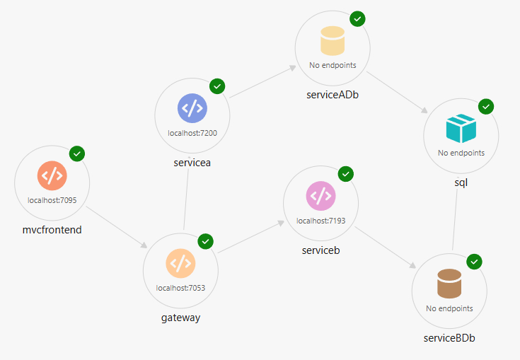

# Indhold for dagen

## Tema

Temaet er Cloud Solutions med .NET Aspire.

## Indhold

Efter en kort introduktion til Cloud Solutions med .NET Aspire vil der være en workshop (som er temmelig relevant for 3. semester)

I forbindelse med workshoppen implementeres en løsning der indeholder elementerne:

- Web frontend
- API gateway (YARP)
- SQL server
- Entity Framework
- API services
- Docker

Sat sammen i en løsning med en Web frontend der anvender et antal services som er "gemt" bag en API gateway.

Der vil være fokus på det eksterne design - dvs. at fokus er på hvorledes komponenterne interagerer med hinanden og ikke på det interne design af de enkelte komponenter (services). Mht. det interne design kan man f.eks. vælge en domain-centric arkitektur som Onion eller Clean Architecture, men det er "out of scope" for denne workshop.

